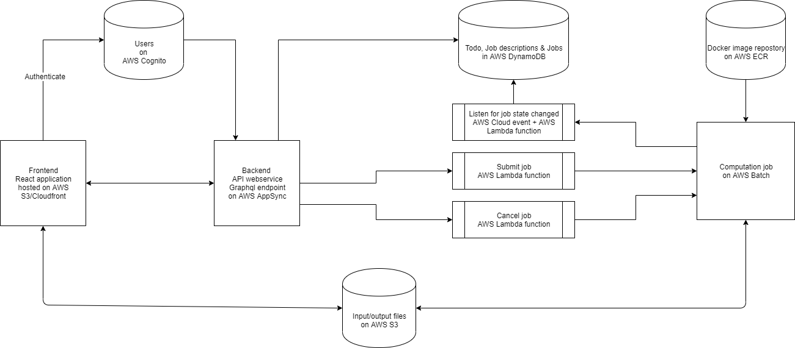

# NLeSC serverless boilerplate

[](https://doi.org/10.5281/zenodo.3628237)

## What is it?

The web application was bootstrapped with [Create React App](https://github.com/facebook/create-react-app).
The web application uses [AWS AppSync](https://aws.amazon.com/appsync/) and [Amplify](https://aws-amplify.github.io/docs/) to setup and run infrastructure.

It uses [AWS Batch](https://aws.amazon.com/batch/) to submit a Docker image as a job.

## Frontend

To have a interactive frontend the backend should first be setup.

### `yarn start`

Runs the app in the development mode.<br />
Open [http://localhost:3000](http://localhost:3000) to view it in the browser.

### `yarn test`

This will run tests of frontend code.

### `yarn build`

Builds the app for production to the `build` folder.<br />

## Backend

### Architecture

* Uses Graphql to communicate between web browser and server
* Uses AWS DynamoDB for persisting data
* Uses AWS S3 for storing input/output data files
* Uses AWS Cognito for authentication
* Uses AWS S3 for deployment
* Uses AWS S3 for hosting
* Uses AWS Batch job, written in Python, to run a computation in a Docker container.
* Uses AWS ECR to store Docker image for AWS Batch
* Uses AWS lambda to submit a AWS Batch job
* Uses AWS lambda to cancel a AWS Batch job
* Uses AWS lambda to listen for a AWS Batch job state changes
* Allows AWS Batch job to read/write to S3 and DynamoDB
* Allows AWS lambda functions to read/write to S3 and DynamoDB

[](docs/architecture.drawio)

### Installation

Requirements: 
* nodejs, tested with v12.13.1
* yarn, NodeJS package manager
* Docker, used for building batch job Docker image
* aws cli (pip install awscli)
* AWS account

Install amplify cli with

```sh
npm install -g @aws-amplify/cli@4.12.0
```

Amplify cli needs to be installed globally, to not pollute your env we suggest to use [nvm](https://github.com/nvm-sh/nvm) to isolate the node env.

Initialize amplify with

```sh
amplify configure
Follow these steps to set up access to your AWS account:

Sign in to your AWS administrator account:
https://console.aws.amazon.com/
Press Enter to continue

Specify the AWS Region
? region:  eu-central-1
Specify the username of the new IAM user:
? user name:  amplify-********
Complete the user creation using the AWS console
https://console.aws.amazon.com/iam/home?region=undefined#/users$new?step=final&accessKey&userNames=amplify-**********&permissionType=policies&policies=arn:aws:iam::aws:policy%2FAdministratorAccess
Press Enter to continue

Enter the access key of the newly created user:
? accessKeyId:   **********
? secretAccessKey:  **********
This would update/create the AWS Profile in your local machine
? Profile Name:  boiler

Successfully set up the new user.
```

To start when there are local amplify resources, but none in cloud with the amplify environment suffix.

```sh
amplify env add
# Asks for new environment name
```

To use current deployed amplify environment in the cloud

```sh
amplify env pull
```

To start when there are no local or cloud amplify resources (not the case for this boilerplate repo).

```sh
amplify init
```
The amplify resources that we made are logged in [docs/log.md](docs/log.md)


### To deploy services

Before amplify push you need to 
1. correct in subnet and security group in `amplify/backend/batch/task/parameters.json`.

```sh
# Deploy backend
amplify push
# Deploy frontend
amplify publish
```

The url where the application is running will be printed to screen.

After amplify you need to
1. Build & push the Docker image (see `amplify/backend/batch/task/` directory) which has the computation in it
2. Create users in [AWS Cognito console](https://eu-central-1.console.aws.amazon.com/cognito/home?region=eu-central-1).
